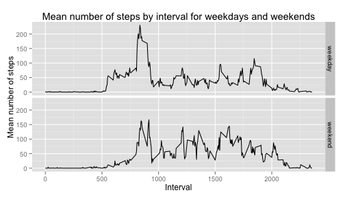

# Reproducible Research: Peer Assessment 1
This is the submission for the Coursera Reproducible Research course Peer Assessment 1.  
Lets first load the data.table package. This package makes life easy for us later when summing up and creating time series plots  and also we will load the plyr package for the ddply function, which makes life easy in calculating subtotals across multiple levels. And also the ggplot2 package for plotting functions.

```r
library(data.table)
library(plyr)
library(ggplot2)
```
Now lets load up the data. We assume activity.zip is in our working directory.  
## Loading and preprocessing the data

```r
unzip("activity.zip")
activity <- read.csv("activity.csv")
ACTIVITY <- data.table(activity)
setkey(ACTIVITY,date)
```
  

## What is mean total number of steps taken per day?

```r
stepsByDate <- ACTIVITY[,sum(steps,na.rm = TRUE),by=date];
hist(x=stepsByDate$V1,plot=TRUE);
```

 

```r
meansteps <- mean(stepsByDate$V1);
mediansteps <- median(stepsByDate$V1);
mean1 <- sprintf("%.0f",meansteps)
median1 <- sprintf("%.0f",mediansteps)
```
The mean total number of steps taken per day is 9354  
The median total number of steps taken per day is 10395  

## What is the average daily activity pattern?  
For this question, lets plot the steps taken for each interval  

```r
stepsByInterval <- ACTIVITY[,mean(steps,na.rm=TRUE),by=interval]
plot(x <- stepsByInterval$interval,y<- stepsByInterval$V1, type = "l",xlab = "Interval",ylab = "Steps")
maxSteps <- max(stepsByInterval$V1)
maxInterval <- stepsByInterval$interval[which.max(stepsByInterval$V1)]
abline(v=maxInterval,col=3)
axis(side=1,at=maxInterval,col=3)
```

 

```r
mI <- sprintf("%.0f",maxInterval)
mS <- sprintf("%.0f",maxSteps)
```
    
Interval 835 has the maximum average number of steps of 206  
  

## Imputing missing values  
Lets use is.na to count missing values in the steps variable  

```r
missingValues <- sum(is.na(ACTIVITY$steps))
```
  
There are 2304 missing values in the data set  
Now lets use the mean for the interval to fill in missing values  

```r
mVLogical <- is.na(ACTIVITY$steps)
ACTIVITY2<-ACTIVITY
for (i in 1:length(ACTIVITY2$steps)){
  if (is.na(ACTIVITY2$steps[i])){
    interval <- ACTIVITY2$interval[i]
    ACTIVITY2$steps[i] <- stepsByInterval$V1[which(stepsByInterval$interval==interval)]
  }
}
```
    
Now lets compute mean total number of steps for new dataset with NA's filled in and also find mean and media for new data set  

```r
stepsByDate2 <- ACTIVITY2[,sum(steps,na.rm = TRUE),by=date]
mean2 <- sprintf("%.0f",mean(stepsByDate2$V1))
median2 <- sprintf("%.0f",median(stepsByDate2$V1))
hist(x=stepsByDate2$V1,plot=TRUE)
```

 
  
Mean steps with NA's filled in with imputed data is 10766  
Median steps with NA's filled in with imputed data is 10766  
As we can see the mean and median are now both identical and are both a little higher than with the original data  
  

## Are there differences in activity patterns between weekdays and weekends?  
Lets first convert the interval to time and then use the weekdays function to assign day of the week.  
Then add weekend and weekday labels and calculate average by interval for each day.  


```r
dt2 <- paste(ACTIVITY2$date,sprintf("%04d",ACTIVITY2$interval))
days <- weekdays(as.POSIXct(dt2))
wdays <- ifelse(days %in% c('Saturday','Sunday'), 'weekend', 'weekday')
ACTIVITY2$wdays <- as.factor(wdays)

activitymeans <- ddply(ACTIVITY2,c('interval','wdays'),function(x) c(Mean=mean(x$steps)))
```
  
Here we create a qplot with the weekday/weekend as two panels to compare the activity patterns

```r
qplot(data=activitymeans,
      x=interval,y=Mean,
      geom="line",
      facets=wdays~.
      )
```

 
  
From the plot it is clear that the peak mean number of steps on weekends is lower than for weekdays and also there is more activity throughout the day.    
In addition, the weekday steps taken start picking up earlier than on weekends and also end earlier than on weekends. Probably a reflection of the typical working day schedule.  

